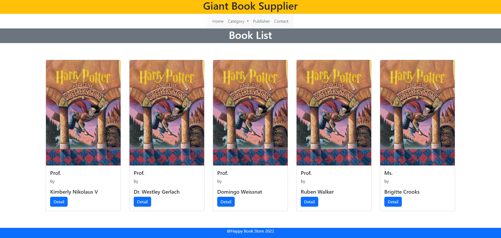
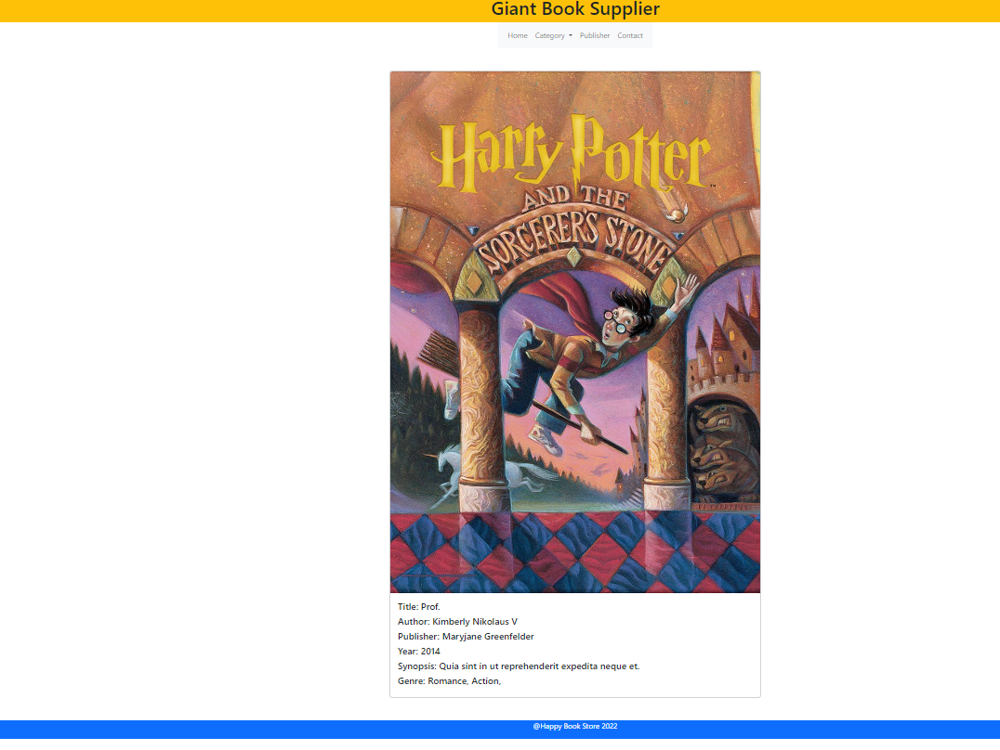
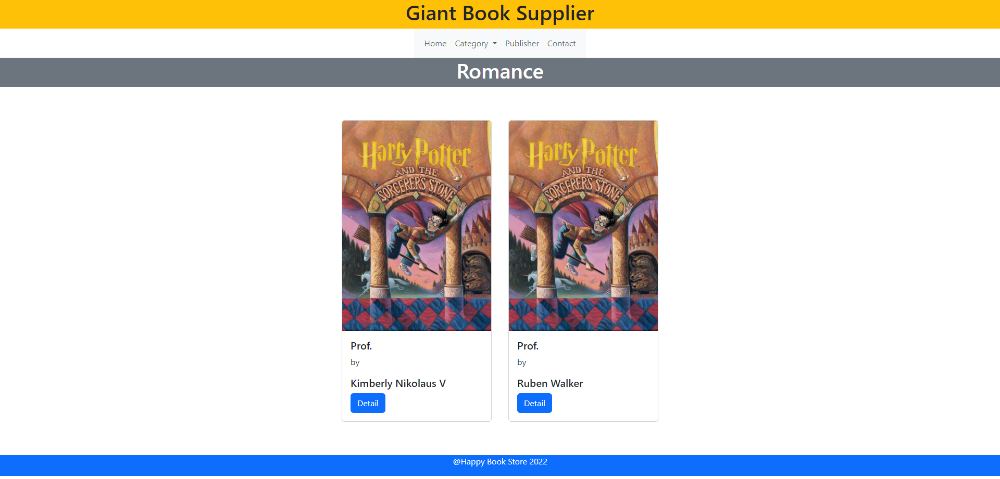
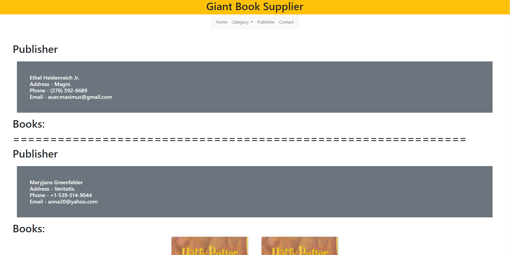
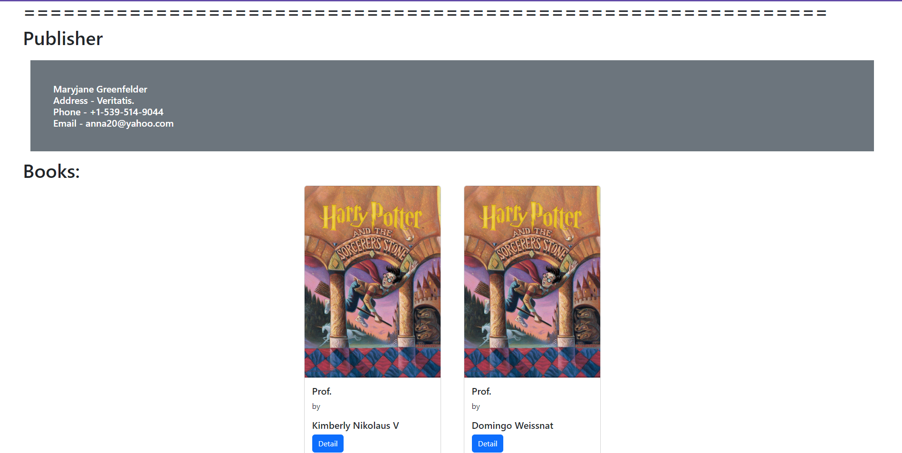
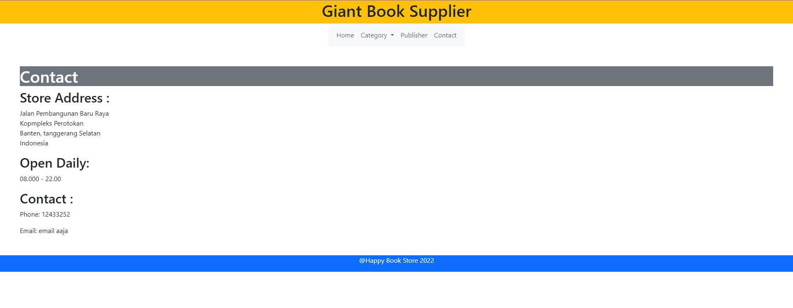

# Display:












# Setup:

open terminal

git clone https://github.com/joshuajevon/WebProg.git (in your terminal)

don't forget to add env file setup on your project

Run:
```
composer install
```

Your application is ready to serve
```
php artisan serve
```
